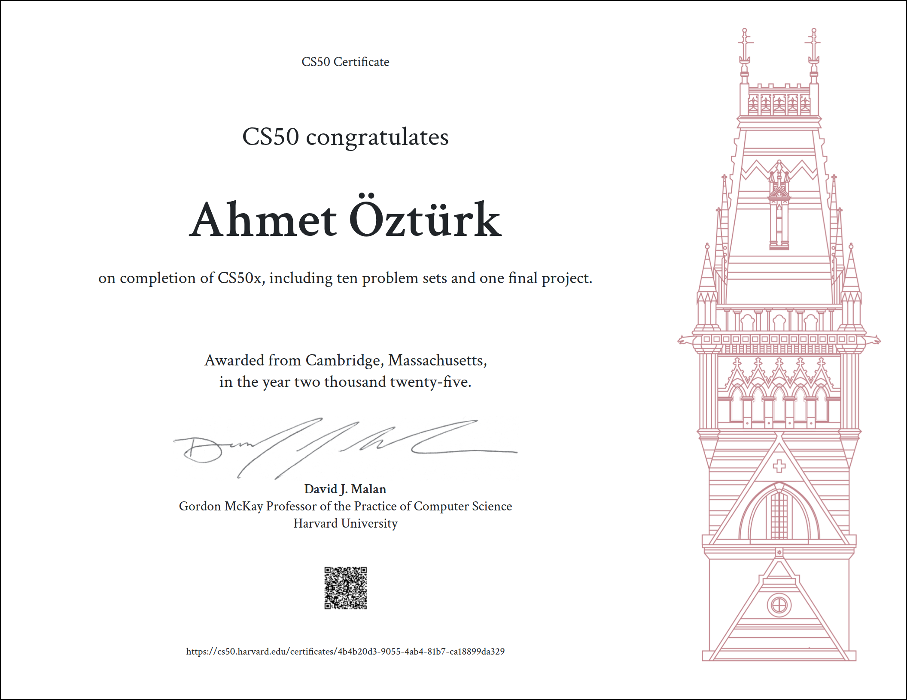

# Harvard CS50x – Problem Set & Final Project Solutions

This repository contains my solutions to [CS50’s Introduction to Computer Science](https://cs50.harvard.edu/x/), also known as **CS50x**, Harvard University’s free online computer science course.  

The course covers fundamental concepts of computer science, programming, and software development, using languages such as **C, Python, SQL, HTML, CSS, and JavaScript**.

---

## Certificate

---

## 🚀 Topics Covered

- **C Programming**: data types, functions, arrays, pointers, memory, data structures  
- **Algorithms**: searching, sorting, recursion, complexity analysis  
- **Python**: scripting, data structures, libraries  
- **SQL**: relational databases, queries, schema design  
- **Web Development**: HTML, CSS, JavaScript, Flask  
- **Final Project**: A pygame-based project applying course concepts

---

## 📂 Repository Structure

### Problem Sets
- [pset0](pset0/)
  - [scratch](pset0/README.md) `# Scratch project`
- [pset1](pset1/)
  - [me](pset1/me/) `# Hello $NAME program`
  - mario-less or [mario-more](pset1/mario/more/) `# Pyramid programs`
  - cash or [credit](pset1/credit/) `# Cash counter / Credit card validator`
- [pset2](pset2/)
  - [scrabble](pset2/scrabble/) `# Scrabble scoring`
  - [readability](pset2/readability/) `# Text readability`
  - caesar or [substitution](pset2/substitution/) `# Cipher programs`
- [pset3](pset3/)
  - [sort](pset3/sort/) `# Sorting algorithms`
  - [plurality](pset3/plurality/) `# Voting plurality`
  - runoff or [tideman](pset3/tideman/) `# Election programs`
- [pset4](pset4/)
  - [volume](pset4/volume/) `# Volume calculation`
  - filter-less or [filter-more](pset4/filter/more/) `# Image filters`
  - [recover](pset4/recover/) `# JPEG recovery`
- [pset5](pset5/)
  - [inheritance](pset5/inheritance/) `# Object-oriented inheritance`
  - [speller](pset5/speller/) `# Spell checker`
- [pset6](pset6/)
  - [sentimental](pset6/sentimental/)
    - [hello](pset6/sentimental/hello/)
    - mario-less or [mario-more](pset6/sentimental/mario/more/)
    - cash or [credit](pset6/sentimental/credit/)
    - [readability](pset6/sentimental/readability/)
  - [dna](pset6/dna/) `# DNA matching`
- [pset7](pset7/)
  - [songs](pset7/songs/) `# Song database`
  - [movies](pset7/movies/) `# Movie database`
  - [fiftyville](pset7/fiftyville/) `# Web application`
- [pset8](pset8/)
  - [trivia](pset8/trivia/) `# Trivia web app`
  - [homepage](pset8/homepage/) `# Personal homepage`
- [pset9](pset9/)
  - [birthdays](pset9/birthdays/) `# Birthday web app`
  - [finance](pset9/finance/) `# Finance web app`

### Final Project
- [project](https://github.com/ztrahmet/pygame-jetfighter.git) `# Pygame-based application`

---

## ⚠️ Academic Honesty

These solutions are shared for **educational purposes only**.  
If you are currently taking CS50x, please adhere to the [Academic Honesty policy](https://cs50.harvard.edu/x/honesty/).  
Do **not** copy these solutions directly—use them to compare approaches after solving problems on your own.

---

## ⚠️ License

Some starter files, examples, or libraries are provided by the CS50 team.  

Please refer to the [CS50x website](https://cs50.harvard.edu/x/) for their official licensing and usage terms.
